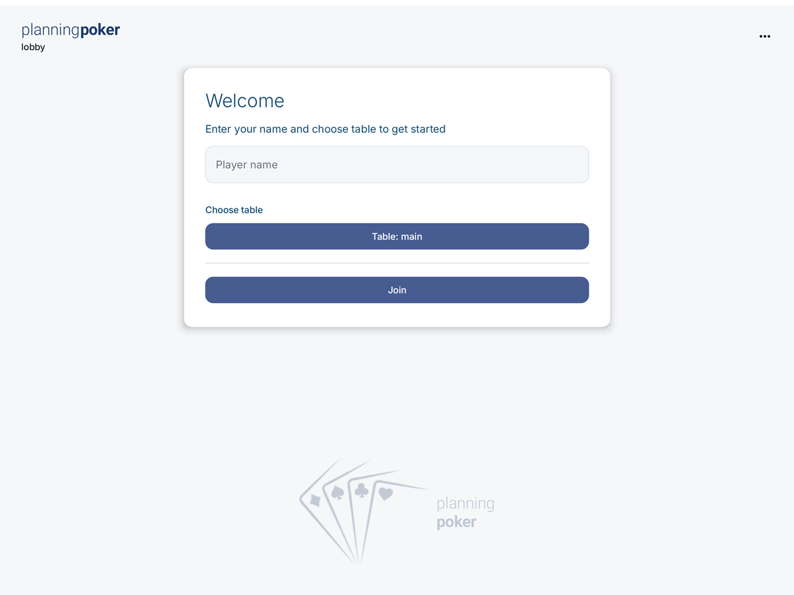
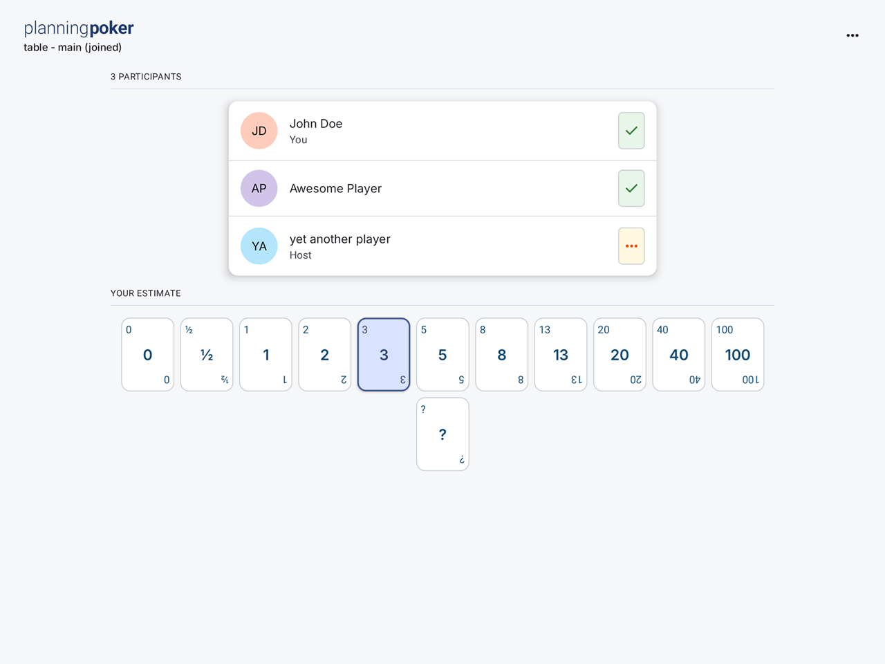
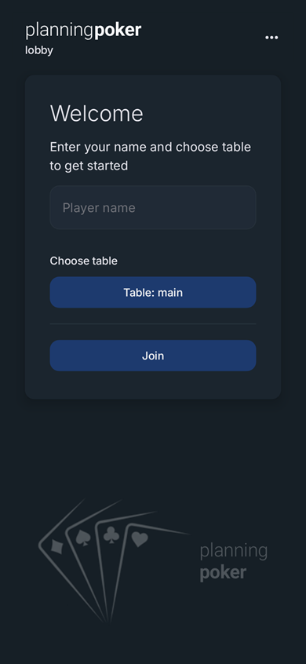
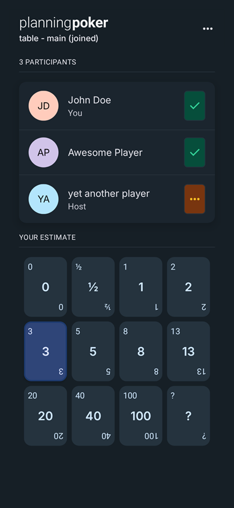

# Planning Poker

Planning Poker is a Kotlin Multiplatform learning project for Scrum estimation.

The repository contains:

- `androidApp` - Android entry point application module
- `composeApp` - shared Compose Multiplatform UI and client code
- `shared` - shared models and serialization contracts
- `server` - Ktor backend with WebSocket support

## Screenshots

### Web

<p>
  
  
</p>

### Android

<p>
  
  
</p>

## Tech Stack

- Kotlin Multiplatform
- Compose Multiplatform
- Kotlin/Wasm for the web target
- Ktor server
- Ktor client with WebSockets
- Koin for dependency injection
- Compose Multiplatform resources for localized strings, fonts, and drawables
- Inter font and Material icons

## Project Structure

### `androidApp`

Android launcher module. This module exists because with newer AGP versions the Android app entry point should be separated from the Kotlin Multiplatform library modules.

### `composeApp`

Shared UI and app logic for Android and Web.

Important source sets:

- `commonMain` - shared screens, view models, navigation, client logic
- `androidMain` - Android-specific actual implementations
- `wasmJsMain` - web-specific actual implementations

Current UI notes:

- lobby and table screens are implemented in shared Compose code
- table UI has responsive phone / browser layout constraints
- table screen includes a top bar with table name and connection state
- player rows show current player, host role, and vote state
- planning cards support selected, disabled, hover, focus, and pressed states
- preview data lives in feature-local preview fixtures instead of shared DTOs

### `shared`

Shared domain and protocol layer:

- serializable messages
- server/client contracts
- shared table and round models
- shared deck and known-table definitions
- public vote states, including hidden votes, revealed votes, missed votes, and not-voted state

### `server`

Ktor backend application.

Main entry point:

- `pl.cube.planning_poker.ApplicationKt`

## Requirements

- JDK 17 or newer
- Android Studio
- Android SDK

If Gradle cannot find Java, make sure `JAVA_HOME` points to a valid JDK.

## Build Commands

- Android app: `./gradlew :androidApp:assembleDebug`
- Android install with local backend reverse: `./gradlew :androidApp:installDebug`
- Web app: `./gradlew :composeApp:wasmJsBrowserDevelopmentRun`
- Web production distribution: `./gradlew :composeApp:wasmJsBrowserDistribution`
- Server compile: `./gradlew :server:compileKotlin`
- Server run: `./gradlew :server:run`
- Server run with auto-restart on changes: `./gradlew :server:run --continuous`
- Server distribution: `./gradlew :server:installDist`
- Docker image: `docker build -t planning-poker .`

On Windows, use `gradlew.bat` or `./gradlew` from PowerShell.

## Running the Server

There are two supported ways to run the backend during development.

### Option 1. Run server through Gradle

Commands:

- `./gradlew :server:run`
- `./gradlew :server:run --continuous`

Use this when:

- you want the simplest workflow
- you want to keep working directly with Gradle tasks
- `server` and `web` can already run together in your local setup

Notes:

- `:server:run` starts the backend once
- `:server:run --continuous` watches for backend changes and reruns the task when needed
- `--continuous` is useful while iterating on server code, but it is still a Gradle-driven workflow rather than true hot reload

### Option 2. Run server outside Gradle

Commands:

```powershell
./gradlew :server:installDist
./server/build/install/server/bin/server.bat
```

Use this when:

- Gradle long-running tasks start blocking each other
- Android Studio keeps showing `Gradle Build Running`
- you want the backend as a plain JVM process independent from Gradle

This option is also useful if you want a more isolated setup for debugging or troubleshooting Gradle-related issues.

## Running Multiple Targets Together

There are two valid workflows.

### Workflow A. Gradle-first

Use this if it works reliably in your environment.

Recommended order:

- start server with `./gradlew :server:run`
  or `./gradlew :server:run --continuous`
- run the web app as a Gradle task
- run the Android app from Android Studio

This is the simplest workflow when Gradle does not block parallel work for you.

### Workflow B. Mixed setup

Use this if long-running Gradle tasks start blocking each other.

Recommended order:

1. Run server outside Gradle
2. Start `PlanningPoker Web`
3. Start `PlanningPoker Android`

With this setup:

- server runs as a plain JVM process
- web uses Gradle dev task
- android uses the Android app run configuration

This avoids Gradle lock contention between long-running tasks.

## Recommended Android Studio Run Configurations

Create at least two Android Studio run configurations, and optionally a third one for the server if you prefer IDE-based backend startup.

### 1. Web

Type:

- `Gradle`

Use:

- Name: `PlanningPoker Web`
- Tasks: `:composeApp:wasmJsBrowserDevelopmentRun`

This starts the web development server.

### 2. Android

Type:

- standard Android application configuration

Use:

- Name: `PlanningPoker Android`
- Module: `androidApp`

Run it on an emulator or device.

#### Android local backend note

For Android local development, the app is configured to use:

- `ws://127.0.0.1:8080/table`

For terminal installs, use:

```powershell
./gradlew :androidApp:installDebug
```

This task runs `adb reverse tcp:8080 tcp:8080` before install.

For Android Studio `Android App` run configuration, add a `Before launch` Gradle task:

- `:androidApp:adbReverseLocalBackend`

This is needed because the standard IDE deploy path does not automatically run Gradle install tasks.

### 3. Optional server configuration in Android Studio

Type:

- `Application`

Use:

- Name: `PlanningPoker Server`
- Main class: `pl.cube.planning_poker.ApplicationKt`
- Use classpath of module: `server.main`
- VM options: `-Dio.ktor.development=true`

Depending on Android Studio and current Gradle integration, this may still behave like a Gradle-backed run. If it works well in your environment, it is fine to use. If it keeps blocking other Gradle tasks, prefer running the server through `:server:run` or from the installed distribution.

## Debugging the Server

Server can be debugged in more than one way.

### Debug option 1. Android Studio `Application` configuration

Use this if the IDE-based server launch works well in your setup.

- it does not block Gradle tasks for web builds
- it gives you standard JVM debugging
- it is easier to inspect backend flow and WebSocket handling

To debug:

1. Select `PlanningPoker Server`
2. Click `Debug`
3. Add breakpoints in backend files
4. Trigger requests from the web or Android client

### Debug option 2. Attach debugger to a server started outside Gradle

First start the server with debug enabled:

```powershell
$env:JAVA_OPTS='-agentlib:jdwp=transport=dt_socket,server=y,suspend=n,address=5005'
./server/build/install/server/bin/server.bat
```

Then create a `Remote JVM Debug` configuration in Android Studio and attach to:

- host: `localhost`
- port: `5005`

This option is useful if you want debugging without tying the server lifecycle to Gradle.

## Direct Table URLs

The app supports table-first links.

Examples:

- `http://localhost:8081/#table/main`
- `http://localhost:8081/#table/main/Alice`

Behavior:

- if `tableId` is present but `player` is missing, app redirects to lobby with that table preselected
- if both are present, app tries to enter the table directly
- unknown table ids are rejected

## Deploying to Render

The simplest production setup is one Render Web Service built from the repository `Dockerfile`.

The Docker image:

- builds the Compose Wasm production distribution
- builds the Ktor server distribution
- installs a minimal Android SDK platform because the shared `composeApp` module configures an Android target during Gradle configuration
- installs the native library required by the Node runtime used during Kotlin/Wasm packaging
- copies the web assets into `/app/public`
- starts the Ktor server as the public web process

Render setup:

- Service type: `Web Service`
- Runtime: `Docker`
- Dockerfile path: `./Dockerfile`
- Environment variables: none required for the MVP

Runtime notes:

- Render provides the `PORT` environment variable. The server reads it automatically and falls back to `8080` locally.
- The web client connects to `/table` on the same host in production, using `wss` when the page is served over HTTPS.
- WebSockets are served by the same Ktor process as the static frontend.

Local Docker smoke test:

```powershell
docker build -t planning-poker .
docker run --rm -p 8080:8080 planning-poker
```

Then open:

- `http://localhost:8080`
- `http://localhost:8080/#table/main`

## Troubleshooting

### Web or Android waits forever after server is started through Gradle

Cause:

- long-running Gradle tasks are blocking each other in the current setup

Fix:

- try `./gradlew :server:run --continuous` if plain `:server:run` behaves worse
- if Gradle still blocks other targets, run the server outside Gradle with `installDist`
- if IDE-based `Application` launch behaves well on your machine, that is also a valid option

### Android emulator cannot connect to local backend

Use one of these:

- `./gradlew :androidApp:installDebug`
- Android Studio `Before launch` Gradle task: `:androidApp:adbReverseLocalBackend`

The Android client uses `127.0.0.1:8080` for local development, so `adb reverse` must be active before starting the app.

### App closes when backend is unavailable

Current behavior:

- table entry should now surface a connection error in UI instead of crashing

If it still closes:

- check Logcat for the first thrown exception
- verify server is reachable on port `8080`
- verify `adb reverse tcp:8080 tcp:8080` is active for Android local development

## Current Status

Current MVP baseline includes:

- lobby flow with player name validation
- table-aware navigation and direct table URLs
- shared snapshot-based WebSocket protocol
- join, vote, unselect vote, reveal, and reset round flow
- host-only reveal and reset by default
- explicit missed-vote state after reveal
- visible join and connection failures in UI
- explicit connection state in the table top bar
- improved table UI with responsive layout, player list, interactive cards, dark / light theme colors, Inter font, and Material icons
- leave-table behavior when the table screen is dismissed

UI and UX polish are still in progress, mainly around empty, reconnect, and recovery states.

## Third-Party Assets

The app bundles Inter and Material icons. See `THIRD_PARTY_NOTICES.md` for license details.
